# Architecture Documentation

## 🏗️ Hexagonal Architecture Overview

This project implements **Domain-Driven Hexagonal Architecture** (Ports & Adapters pattern) to achieve clean separation of concerns and maintain semantic integrity.

## 📊 Architecture Diagram

```mermaid
graph TB
    subgraph Presentation["🌐 Presentation Layer"]
        Router[MCPRouter<br/>HTTP Routing]
        CORS[CORSMiddleware<br/>Cross-cutting]
    end

    subgraph Application["⚙️ Application Layer"]
        ToolHandler[ToolExecutionHandler<br/>MCP Tool Orchestration]
        ProtocolHandler[MCPProtocolHandler<br/>JSON-RPC Protocol]
    end

    subgraph Domain["💎 Domain Layer - Business Logic"]
        Service[ContextService<br/>Core Business Logic]
        Entity[ContextSnapshot<br/>Domain Entity]
    end

    subgraph Ports["🔌 Ports - Interfaces"]
        IRepo[IContextRepository<br/>Persistence Port]
        IAI[IAIProvider<br/>AI Service Port]
    end

    subgraph Infrastructure["🔧 Infrastructure Layer - Adapters"]
        D1Adapter[D1ContextRepository<br/>Cloudflare D1 Adapter]
        AIAdapter[CloudflareAIProvider<br/>Workers AI Adapter]
    end

    subgraph External["☁️ External Services"]
        D1[(Cloudflare D1<br/>Database)]
        WorkersAI[Workers AI<br/>LLaMA 4 Scout]
    end

    Router --> CORS
    Router --> ProtocolHandler
    ProtocolHandler --> ToolHandler
    ToolHandler --> Service
    Service --> Entity
    Service --> IRepo
    Service --> IAI
    IRepo -.implements.-> D1Adapter
    IAI -.implements.-> AIAdapter
    D1Adapter --> D1
    AIAdapter --> WorkersAI

    style Domain fill:#e1f5e1
    style Ports fill:#fff4e1
    style Infrastructure fill:#e1f0ff
    style External fill:#f0f0f0
```



## 🎯 Layer Responsibilities

### 1. **Domain Layer** (Core Business Logic)

**Location:** `src/domain/`

**Purpose:** Pure business logic with no infrastructure dependencies.

**Components:**
- **ContextSnapshot** - Domain entity with validation rules
- **ContextService** - Core business operations

**Principles:**
- ✅ No infrastructure dependencies
- ✅ Pure TypeScript (no external libs)
- ✅ Self-validating entities
- ✅ Semantic intent documentation

**Example:**
```typescript
// src/domain/models/ContextSnapshot.ts
export class ContextSnapshot {
  // Immutable, self-validating entity
  constructor(
    public readonly id: string,
    public readonly project: string,
    public readonly summary: string
  ) {
    this.validate(); // Business rules enforced
  }
}
```

---

### 2. **Application Layer** (Orchestration)

**Location:** `src/application/`

**Purpose:** Coordinate domain operations and external interactions.

**Components:**
- **ToolExecutionHandler** - Routes MCP tool calls to domain
- **MCPProtocolHandler** - Manages JSON-RPC protocol

**Principles:**
- ✅ Orchestrates domain services
- ✅ Translates external requests to domain operations
- ✅ Formats domain responses for external use
- ✅ No business logic (delegates to domain)

**Example:**
```typescript
// src/application/handlers/ToolExecutionHandler.ts
export class ToolExecutionHandler {
  async execute(toolName: string, args: unknown) {
    // Translates MCP → Domain
    const result = await this.contextService.saveContext(args);
    // Formats Domain → MCP
    return this.formatResponse(result);
  }
}
```

---

### 3. **Infrastructure Layer** (Technical Adapters)

**Location:** `src/infrastructure/`

**Purpose:** Implement technical concerns (database, AI, HTTP).

**Components:**
- **D1ContextRepository** - Cloudflare D1 database adapter
- **CloudflareAIProvider** - Workers AI adapter
- **CORSMiddleware** - Cross-cutting HTTP concerns

**Principles:**
- ✅ Implements port interfaces
- ✅ Swappable (D1 → Postgres)
- ✅ Technical details isolated
- ✅ Graceful error handling

**Example:**
```typescript
// src/infrastructure/adapters/D1ContextRepository.ts
export class D1ContextRepository implements IContextRepository {
  constructor(private readonly db: D1Database) {}

  async save(snapshot: ContextSnapshot): Promise<string> {
    // D1-specific implementation
    await this.db.prepare(SQL).bind(...).run();
    return snapshot.id;
  }
}
```

---

### 4. **Presentation Layer** (HTTP Routing)

**Location:** `src/presentation/`

**Purpose:** Handle HTTP requests and routing.

**Components:**
- **MCPRouter** - Routes requests to handlers

**Principles:**
- ✅ Minimal logic (pure routing)
- ✅ Delegates to application layer
- ✅ Handles HTTP concerns only

**Example:**
```typescript
// src/presentation/routes/MCPRouter.ts
export class MCPRouter {
  async route(request: Request): Promise<Response> {
    if (pathname === '/mcp') {
      return await this.protocolHandler.handle(body);
    }
  }
}
```

---

## 🔌 Ports & Adapters Pattern

### Ports (Interfaces)

**Location:** `src/application/ports/`

Ports define **what** the domain needs, without specifying **how** it's implemented.

```typescript
// Port: What we need
export interface IContextRepository {
  save(snapshot: ContextSnapshot): Promise<string>;
  findByProject(project: string): Promise<ContextSnapshot[]>;
}
```

### Adapters (Implementations)

**Location:** `src/infrastructure/adapters/`

Adapters provide **how** the ports are implemented.

```typescript
// Adapter: How we implement it (D1)
export class D1ContextRepository implements IContextRepository {
  // D1-specific implementation
}

// Could swap with:
export class PostgresContextRepository implements IContextRepository {
  // Postgres-specific implementation
}
```

---

## 🔄 Request Flow

### Saving Context Example


---

## 📦 Dependency Flow


**Key Principles:**
- ✅ Domain **NEVER** depends on infrastructure
- ✅ Infrastructure **implements** ports defined by domain/application
- ✅ Dependencies point **inward** toward domain
- ✅ Outer layers depend on inner layers, never reversed

---

## 🎨 Design Patterns Used

### 1. **Dependency Injection**

```typescript
// Composition root (src/index.ts)
const repository = new D1ContextRepository(env.DB);
const aiProvider = new CloudflareAIProvider(env.AI);
const service = new ContextService(repository, aiProvider);
```

### 2. **Repository Pattern**

```typescript
interface IContextRepository {
  save(snapshot: ContextSnapshot): Promise<string>;
  findByProject(project: string): Promise<ContextSnapshot[]>;
}
```

### 3. **Factory Pattern**

```typescript
// Entity creation with validation
ContextSnapshot.create({ project, summary, tags });
```

### 4. **Strategy Pattern**

```typescript
// Different AI providers can be swapped
class OpenAIProvider implements IAIProvider { }
class ClaudeProvider implements IAIProvider { }
```

---

## 🔒 Semantic Integrity Guarantees

### Entity Validation

```typescript
class ContextSnapshot {
  private validate(): void {
    if (!this.project) {
      throw new Error('Semantic violation: Project required');
    }
  }
}
```

### Immutability

```typescript
// All entity properties are readonly
public readonly id: string;
public readonly project: string;
```

### Type Safety

```typescript
// Compile-time semantic contracts
interface IContextRepository {
  save(snapshot: ContextSnapshot): Promise<string>;
}
```

---

## 📊 Metrics

| Metric | Before Refactoring | After Refactoring |
|--------|-------------------|-------------------|
| **Lines in index.ts** | 483 | 74 |
| **Code Reduction** | - | **90%** |
| **Layers** | 1 (monolith) | 4 (separated) |
| **Test Coverage** | 0% | 70 tests |
| **Architecture Files** | 1 | 11 |

---

## 🚀 Extending the Architecture

### Adding a New Feature

1. **Domain Layer**: Create entity + business logic
2. **Application Ports**: Define interface if needed
3. **Infrastructure**: Implement adapter
4. **Application Handler**: Add orchestration
5. **Tests**: Unit tests for each layer

### Adding a New Adapter

1. **Create Port Interface**: `src/application/ports/INewService.ts`
2. **Implement Adapter**: `src/infrastructure/adapters/NewServiceAdapter.ts`
3. **Inject in index.ts**: Wire up dependency injection
4. **Add Tests**: Mock and test

---

## 📚 Further Reading

- [Domain-Driven Design](https://martinfowler.com/bliki/DomainDrivenDesign.html)
- [Hexagonal Architecture](https://alistair.cockburn.us/hexagonal-architecture/)
- [Clean Architecture](https://blog.cleancoder.com/uncle-bob/2012/08/13/the-clean-architecture.html)
- [Semantic Intent Patterns](../SEMANTIC_ANCHORING_GOVERNANCE.md)

---

**Questions?** See [CONTRIBUTING.md](../CONTRIBUTING.md) or open a discussion.
